# Follow-Along Activity: Posts DB
In this activity, you will create your own cloud database using MongoDB Atlas and hook it up to an application that allows users to create, read, update, and delete posts from a website.

## MongoDB Atlas: Account Registration
The first step is to sign up for an Atlas account. [Click here for account creation instructions.](MongoDbAtlasRegistration.md)

## Deploying a Cluster
Next, it's time to get a cluster up and running! A cluster is basically a group of databases. We'll only need one database, but it will live in a cluster.

1. [Click here to go to the MongoDB login page](https://account.mongodb.com/account/login)
1. Enter your email address and password, and click the "Login" button
1. From the **Overview** page, click the "+ Create" button under "Create a cluster"

  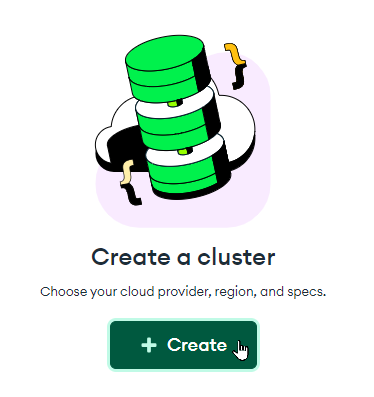

1. In the "Deploy your cluster" section, select the "**M0**" template on the right
1. Leave everything else the same
1. At the bottom of the screen, to the right, click the "Create Deployment" button

  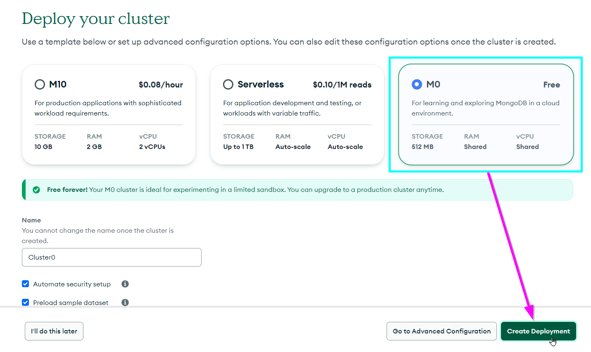

1. Complete the human verification if needed

Now the cluster should be deployed! The next step is to get the connection string for it.

## Getting the Connection String
It is possible to connect to a MongoDB Atlas cluster with a connection string - it's a short piece of text that tells an application how to connect to the cluster. Follow these steps to get the connection string for your newly-deployed cluster:

1. In the popup that appears, click the "Create Database User" button under step 2:

  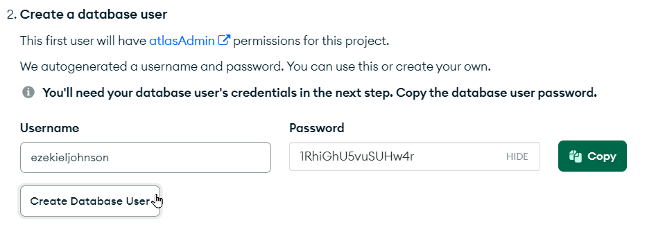

1. Next, click the "Choose a connection method" button in the bottom right of the pop-up:

  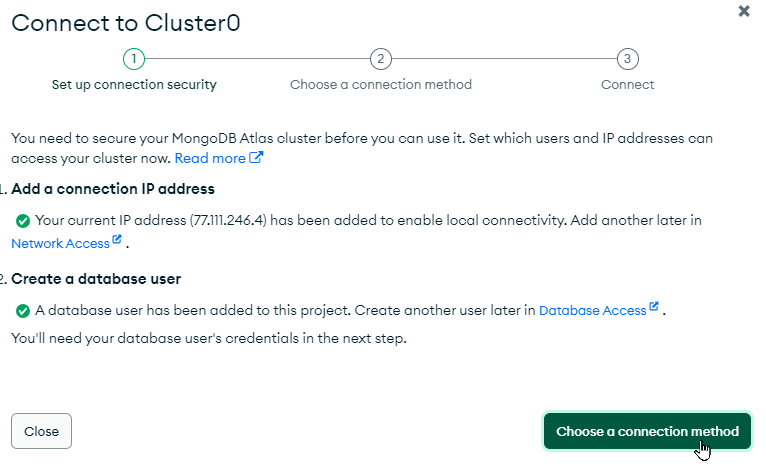

1. In the next pop-up, click the "Drivers" box:

  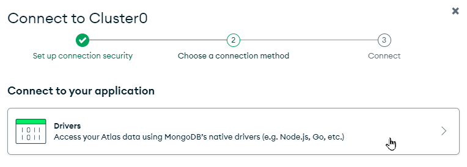

1. In the **Connecting with MongoDB Driver** pop-up, click the copy icon under step 3:

  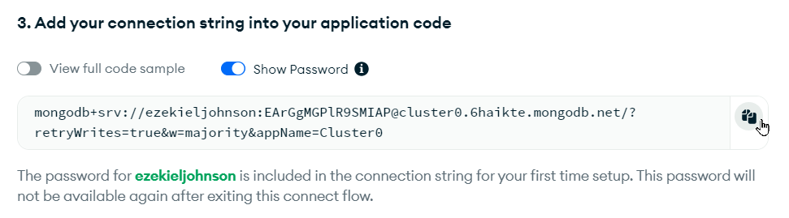

That should be it - you should have your full connection string!

### After the Initial Setup
If you need to get the connection string after the cluster's initial deployment, the steps will be a little different:

1. Click the "Connect" button fro, the **Overview** section in Atlas:

  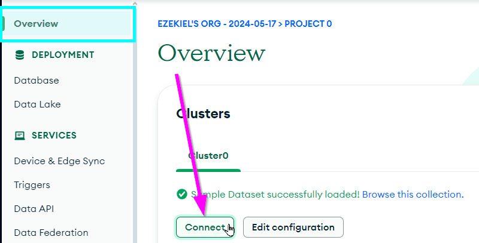

1. Click the "Drivers" box
1. On the next page, click the copy button:

  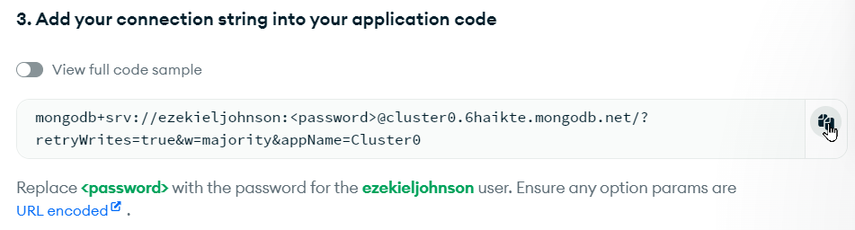

Note that _this_ connection string will NOT work as copied - the `<password>` must be replaced with the database user's password. **This is a different password than the password for your MongoDB Atlas account** - it's the one created with the database user above. If you did not copy the database user's password, you can reset it:

1. Open the **Database Access** page under the **SECURITY** section on the left
1. Click the "EDIT" button next to the admin user

  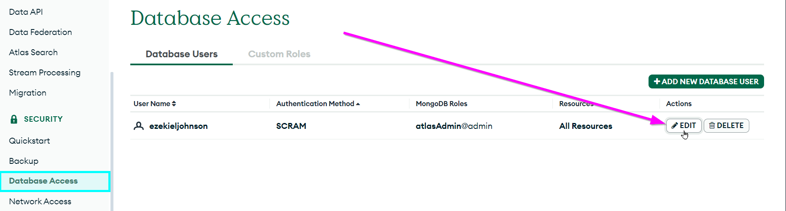

1. On that page, make sure "Password" is selected as the **Authentication Method**
1. Click the "Edit Password" button under **Password Authentication**
1. Enter a new password (or click "Autogenerate Secure Password" if desired)
1. Click the "Copy" button after the password has been entered
1. At the bottom of this pop-up, click the "Update User" button

  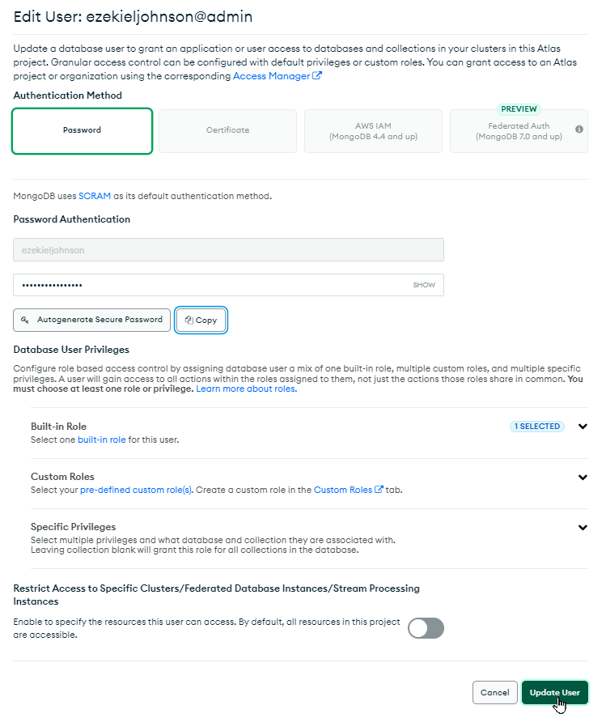

Now, you should be able to edit the connection string. First, make sure that the password is pasted somewhere. Then, replace `<password>` in the connection string with the password copied for the database user!

## Connecting from the Web Application
The next step is to hook up a web application to your database! Luckily, there is a pre-built website application we can use - all we need is the connection string. The application is hosted on [Glitch](https://glitch.com) - an awesome way to create and share web apps.

1. [Click here to remix the Posts DB project on Glitch](https://glitch.com/edit/#!/remix/posts-db)
1. On the left, click the **.env** file to open it

  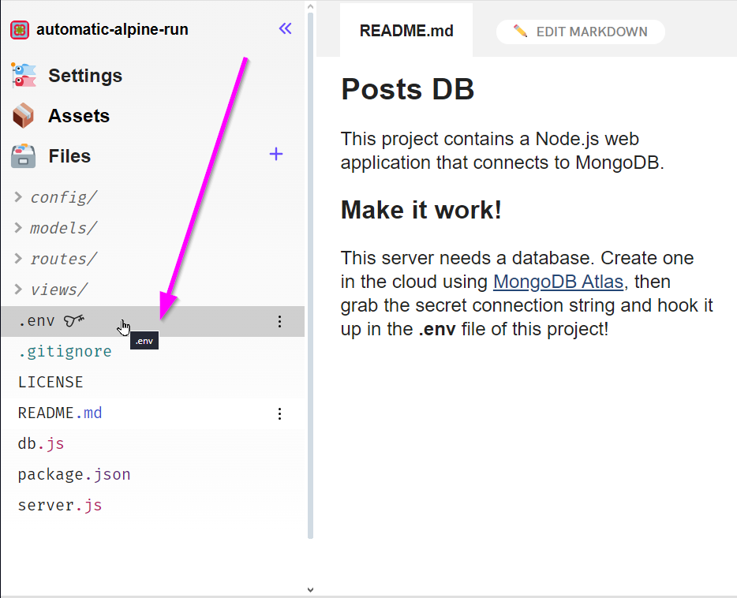

1. In the file, find the `MONGO_URI` variable (under **Variable Name**)
1. In the box under **Value**, paste the connection string

  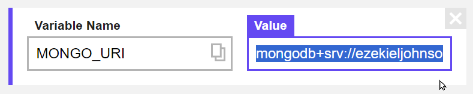

>_Note that if a `MONGO_URI` variable does not exist, you can click the "Add a variable" button and add it_

Now the project is pointing to the right place! There's just one step left to ensure that the application can properly connect to the database.

## Setting Up Network Access
By default, access to the database is restricted to certain networks. Because of the way our web application will work, it will be necessary to allow authenticated users to connect to the cluster from _any_ IP address.

1. [Go back to MongoDB Atlas](https://cloud.mongodb.com/)
1. Open the **Network Access** page under the **SECURITY** section on the left
1. Click the "+ ADD IP ADDRESS" button on the right

  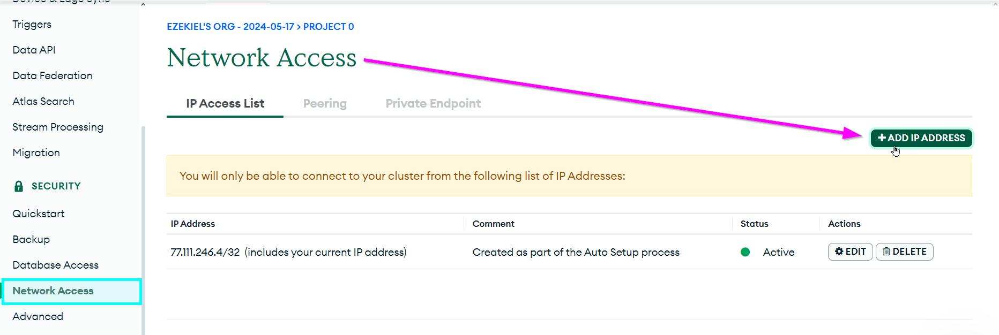

1. In the pop-up that appears, click the "ALLOW ACCESS FROM ANYWHERE" button, and then click "Confirm"

  

At this point, your database should be fully connect-able!

## Testing the Database
Now your website should be fully functional! Head back to Glitch to try it out. Make sure the connection string has been added in the **.env** file for the `MONGO_URI` variable, and open the preview by clicking "PREVIEW" from the bottom and selecting the "Open preview pane" option:

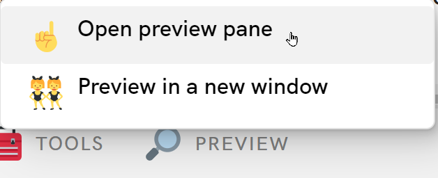

In the web app, try to do the following:

1. Create a few posts
1. View the posts you've created
1. Update at least one of the posts you created
1. Delete at least one of the posts you created

Because your database is in the cloud, you can share access with anyone online! Copy a link to your Glitch project, and share it with whomever you'd like to have access:

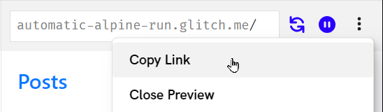

### Viewing the Data in Atlas
The real power here is that the web application provides an interface to the MongoDB database. As the creator and administrator of this database, you can view and modify all of the data as desired!

1. [Go back to MongoDB Atlas](https://cloud.mongodb.com/)
1. Open the **Database** page under the **DEPLOYMENT** section on the left
1. Click the "Browse Collections" button on the right

  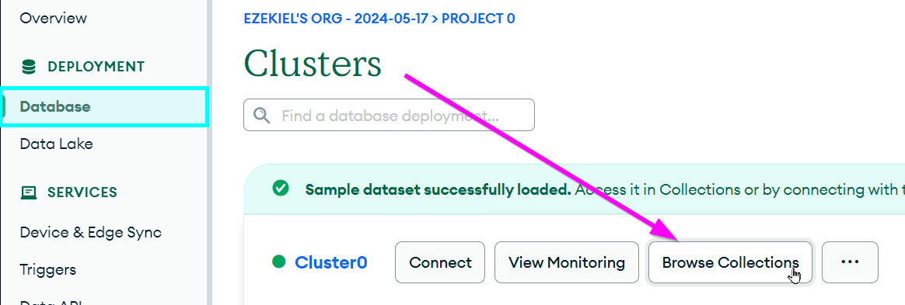

1. With the **posts** database selected, take a look at the contents of the collection

  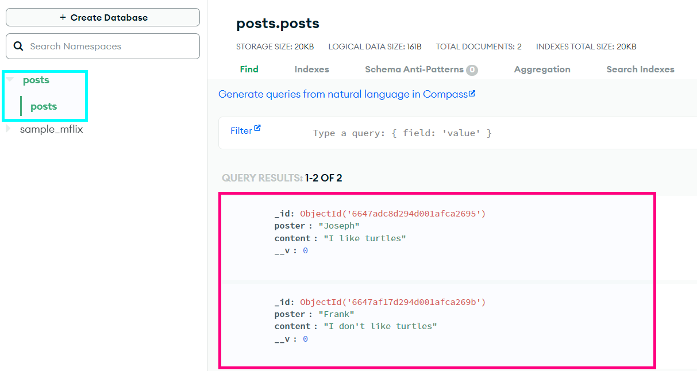

From right here, it's possible to edit or delete any posts that have been added! You can also filter posts. For example, if you wanted to find all the posts written by Frank, you could enter `{poster: "Frank"}` into the Filter box, and click the "Apply" button:

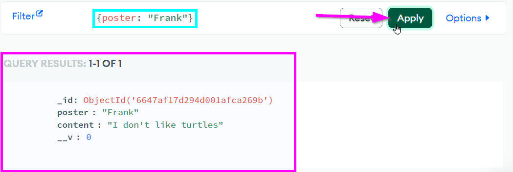

Try to add, modify, or search some more data - see what's possible!

## Conclusion
This activity only showed a little bit of what's possible with MongoDB, and with databases in general. It's a pretty good starting point, but there is so much more to explore!
