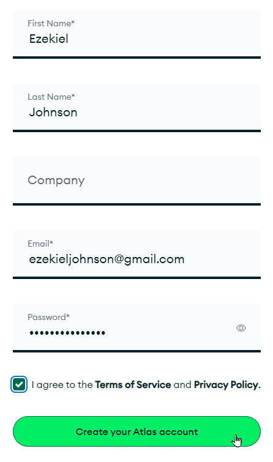
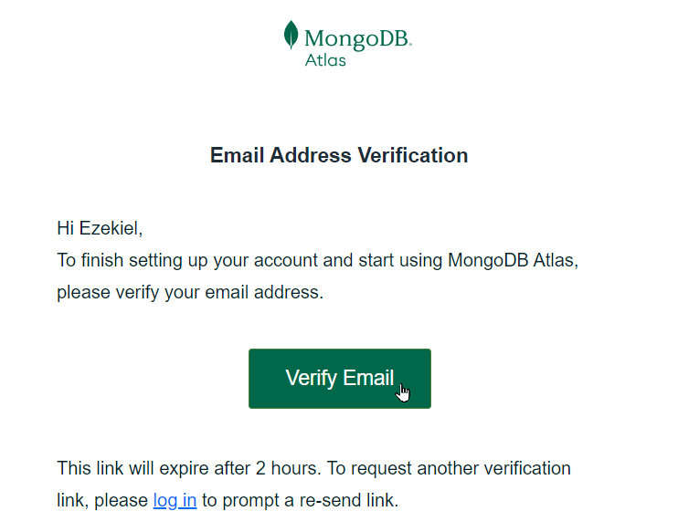
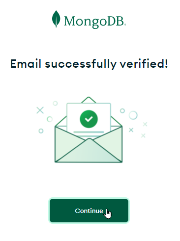
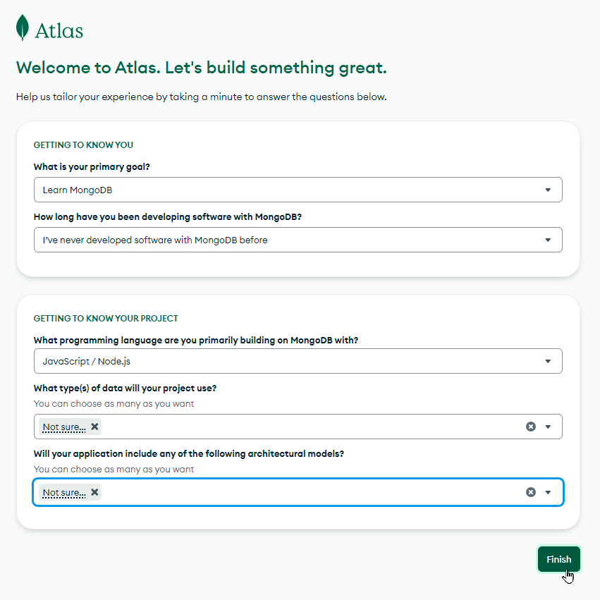

# MongoDB Atlas: Account Registration
[MongoDB Atlas](https://www.mongodb.com/products/platform/atlas-database) is a great way to get started with MongoDB. You can create and deploy a database in the cloud for free, and you can do it pretty quickly too. The first step is to create an Atlas account. Follow these steps:

1. [Click here to go to the Account Registration page](https://www.mongodb.com/cloud/atlas/register)
1. Enter a first name, last name, email address, and password  
  - Make sure to remember your email address and password!!!!
1. Click the "I agree to the **Terms of Service** and **Privacy Policy**" checkbox
1. Click the "Create your Atlas account" button

  

1. Check your email inbox for a verification email from **MongoDB Cloud**
1. When the email arrives, click the "Verify Email" button

  

1. On the page that appears, click the "Continue" button

  

1. On the next page, fill out the form as desired, and click "Finish"

  

From there, you may be redirected to another page - but don't worry about any of that yet! As long as your account has been created, you should be all set.

Just make sure to remember your email address and password!
